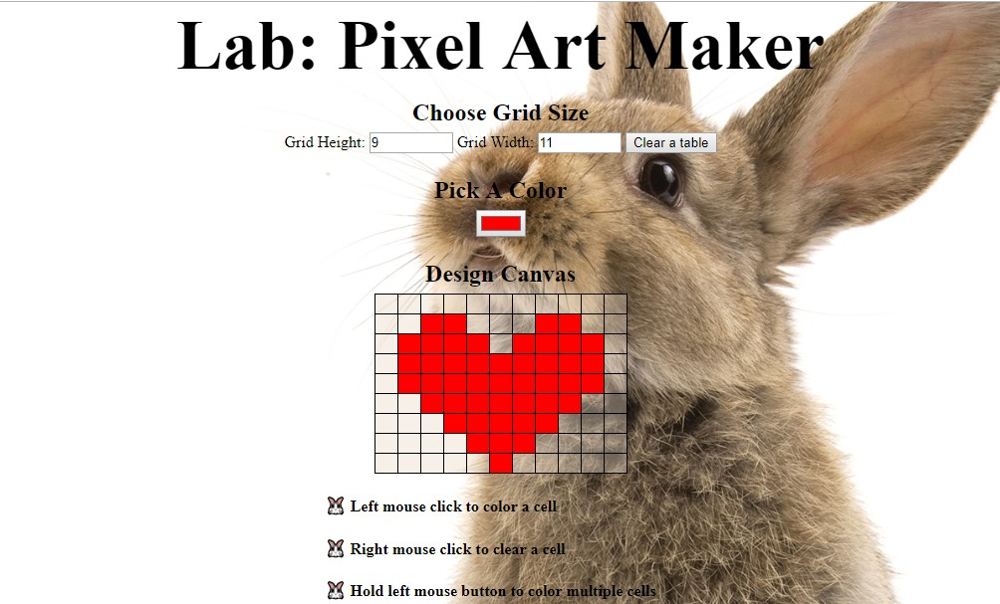

# pixel-art-maker

## A single-page app which allows to draw a pixel art on a customizable canvas.

A user can choose the grid size, which is used by the makeGrid function to build a grid (canvas). 
Event listeners are used to choose a certain color and fill (clear) a grid's cell with it.

The app is available here https://lexie14.github.io/pixel-art-maker/
